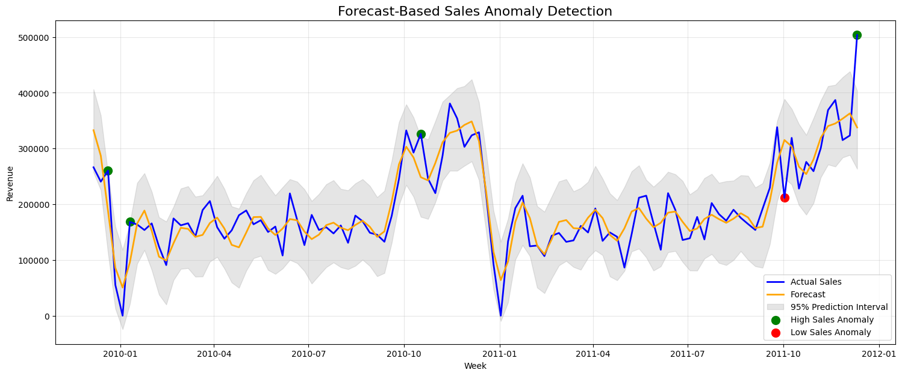
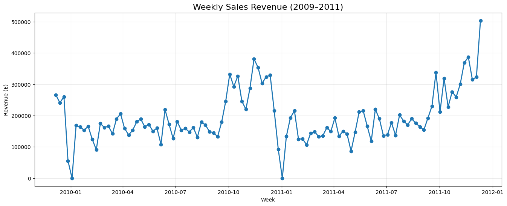

# 📈 Forecast-Based Anomaly Detection for Retail Sales

### AI-Powered Weekly Sales Forecasting using Prophet
An end-to-end machine learning solution that forecasts weekly retail sales, detects anomalies using prediction intervals, performs root cause analysis, and generates business-ready insights.




---

## Weekly Sales Trend




An end-to-end AI solution for forecasting weekly retail sales and detecting meaningful business anomalies using Facebook Prophet.

This project demonstrates how predictive AI can replace static threshold-based monitoring with forecast-driven anomaly detection, reducing false positives while providing explainable business insights.

---

## Business Problem

Traditional anomaly detection systems use fixed thresholds to detect unusual sales activity.

This approach generates excessive false positives because it ignores:

- Seasonality
- Long-term trends
- Business growth
- Holiday effects

This project addresses the problem by forecasting expected sales and detecting anomalies only when actual sales significantly deviate from the forecast.

---

## Solution Architecture

```
Raw Retail Transactions
            │
            ▼
      Data Cleaning
            │
            ▼
   Feature Engineering
            │
            ▼
 Weekly Sales Aggregation
            │
            ▼
 Prophet Forecast Model
            │
            ▼
Prediction Interval Analysis
            │
            ▼
 Sales Anomaly Detection
            │
            ▼
 Root Cause Analysis
            │
            ▼
 Business Recommendations
```

---

## Dataset

**Online Retail II Dataset**

- Source: Kaggle (UCI Machine Learning Repository)
- Period: December 2009 – December 2011
- Original Transactions: **1,067,371**

Dataset Link:

Dataset: [Online Retail II (Kaggle)](https://www.kaggle.com/datasets/mashlyn/online-retail-ii-uci)

---

## Data Cleaning

The following preprocessing steps were performed:

- Removed duplicate transactions
- Removed cancelled invoices
- Removed missing product descriptions
- Removed invalid quantities
- Removed zero-priced items
- Converted InvoiceDate to datetime
- Created TotalSales feature

Final clean dataset:

**1,007,913 transactions**

---

## Forecasting Model

Model Used:

**Facebook Prophet**

The model learns:

- Long-term sales trend
- Yearly seasonality
- Expected weekly sales

Forecasts are generated for weekly aggregated sales.

---

## Model Performance

| Metric | Value |
|---------|------:|
| Original Transactions | 1,067,371 |
| Clean Transactions | 1,007,913 |
| Weekly Observations | 106 |
| Forecast Model | Prophet |
| MAE | £27,549 |
| RMSE | £36,860 |
| High Sales Anomalies | 4 |
| Low Sales Anomalies | 1 |

---

## Key Results

- 📊 Analysed **1,067,371** retail transactions
- 🧹 Cleaned dataset to **1,007,913** high-quality records
- 📅 Aggregated sales into **106 weekly observations**
- 🤖 Built a **Prophet forecasting model**
- 🎯 Achieved **MAE = £27,549**
- 🚨 Detected **5 meaningful anomalies**
- 📄 Generated automated business reports with root-cause analysis

---

## Project Outputs

The project generates:

- Weekly Sales Forecast
- Forecast vs Actual Comparison
- Forecast-Based Anomaly Detection
- Root Cause Analysis
- Executive Business Report
- Executive Summary Dashboard

---

## Repository Structure

```
forecast-based-anomaly-detection/

│
├── notebook/
│   └── forecast-based-anomaly-detection.ipynb
│
├── images/
│   ├── weekly_sales.png
│   ├── forecast1.png
│   ├── forecast2.png
│   └── forecast_final.png
│
├── reports/
│   ├── Anomaly_Report.xlsx
│   ├── Anomaly_Report.csv
│   └── Executive_Summary.xlsx
│
├── presentation/
│   └── ISB_AI_Retail_Sales_Forecasting.pdf
│
├── requirements.txt
├── README.md
└── LICENSE
```

---

## Technologies Used

- Python
- Pandas
- NumPy
- Matplotlib
- Prophet
- Scikit-learn
- Google Colab

---
## Business Impact

Compared with static threshold monitoring, this solution:

- Reduces false-positive alerts
- Detects unusual sales behaviour relative to expected trends
- Provides explainable root-cause analysis for business users
- Supports inventory planning and demand forecasting
- Enables proactive operational decision-making
  
---

## Roadmap

- ✅ Data Cleaning
- ✅ Weekly Sales Forecasting
- ✅ Forecast-Based Anomaly Detection
- ✅ Root Cause Analysis
- ⏳ Interactive Streamlit Dashboard
- ⏳ LLM-powered Business Assistant
- ⏳ Real-Time Alerting

---

## Author

**Vijay Mohan Boddu**

Engineering Manager | AI Enthusiast | ISB – AI in Business

---

## License

This project is released under the MIT License.
